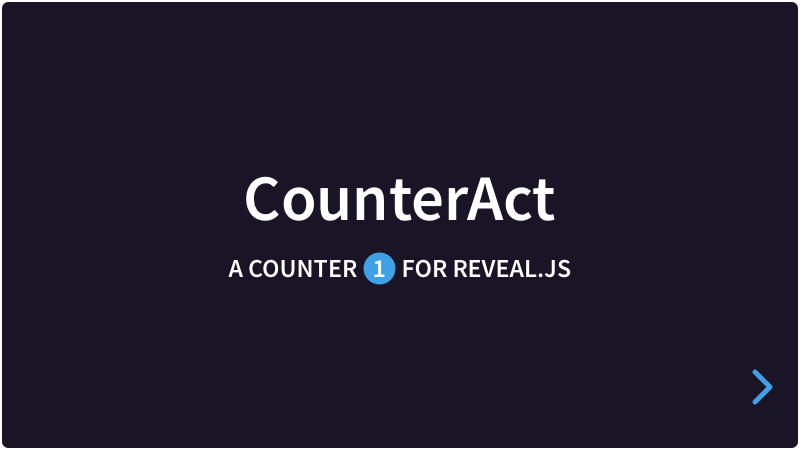

# CounterAct

[](#) [](https://github.com/Martinomagnifico/reveal.js-counteract/archive/refs/heads/master.zip)

Reveal.js optimises the performance of presentations by hiding slides that are more than a few steps in the future. As per the CSS specification, CSS counters simply don’t work in slides that have `display: none`. 

CounterAct goes around this limitation by using data-attributes on the elements that you want to count. Similar to CSS counters, CounterAct lets you define multiple counters. This way, you can have nice numbers in your presentation again. 

[](https://martinomagnifico.github.io/reveal.js-counteract/demo.html)

[Demo](https://martinomagnifico.github.io/reveal.js-counteract/demo.html)


## Installation

### Regular installation

Copy the counteract folder to the plugins folder of the reveal.js folder, like this: `plugin/counteract`.

### npm installation

This plugin is published to, and can be installed from, npm.

```console
npm install reveal.js-counteract
```
The CounterAct plugin folder can then be referenced from `node_modules/reveal.js-counteract/plugin/counteract`


## Setup

### JavaScript

CounterAct works in setups with multiple Reveal instances.

There are two JavaScript files for CounterAct, a regular one, `counteract.js`, and a module one, `counteract.esm.js`. You only need one of them:

#### Regular 
If you're not using ES modules, for example, to be able to run your presentation from the filesystem, you can add it like this:

```html
<script type="text/javascript" src="dist/reveal.js"></script>
<script src="plugin/counteract/counteract.js"></script>
<script>
	Reveal.initialize({
		// ...
		plugins: [ CounterAct ]
	});
</script>
```
#### As a module 
If you're using ES modules, you can add it like this:

```html
<script type="module">
	// This will need a server
	import Reveal from './dist/reveal.esm.js';
	import CounterAct from './plugin/counteract/counteract.esm.js';
	Reveal.initialize({
		// ...
		plugins: [ CounterAct ]
	});
</script>
```


## Configuration

Adding counters in done in the config section of Reveal. 

```javascript
Reveal.initialize({
	// ...
	counteract: {
		counters: [
		// ...   LIST OF COUNTERS ... //
		]
	},
	plugins: [ CounterAct ]
	// ...
});
```

CounterAct expects an array of `counters`. Each of the counters needs at least a `name` and a `selector`. A `reset` and an `increment` are optional. See the next example:

```javascript
counters: [
	{
		name: 'mylist',
		selector: 'ol.list li a',
		increment: 'ol.list li',
		reset: 'ol.list'
	}, {
	// ... more counters if needed ... //
	}
]
```


* **`name`**: `<string>` Every counter needs a name. This name is used as the name for the data-attribute that is added to each selector. By using names, we can use multiple counters at once on a single selector.
* **`selector`**: `<CSS syntax>` Every counter needs a selector. This is where the data-attribute ends up. For each name, the data-attribute gets a `data-count-*` where the wildcard is the name, and the value is the calculated number.
* **`reset`**: `<CSS syntax>, optional` Use this if you want the counter to reset to 0 whenever this element is encountered in the DOM. A reset needs to be up in the DOM tree from the selector.
* **`increment`**: `<CSS syntax>, optional` Use this if you want the counter to increase by 1 whenever this element is encountered in the DOM. A reset needs to be up in the DOM tree from the selector, but down from any reset.

### Styling

For each counter, add CSS rules. You can do that in a separate CSS file, or add it directly to the presentation. 
 
## Example

```javascript
counters: [
	{
		name: 'mylist',
		selector: 'ol.list li a',
		increment: 'ol.list li',
		reset: 'ol.list'
	}, {
	// ... more counters if needed ... //
	}
]
```
```css
ol.list {
	list-style: none;
}
ol.list li:before {
	content: attr(data-count-mylist) ". " ;
	color: #42affa;
}
```

For more examples, see the [demo](https://martinomagnifico.github.io/reveal.js-counteract/demo.html).


## Like it?

If you like it, please star this repo.


## License
MIT licensed

Copyright (C) 2022 Martijn De Jongh (Martino)